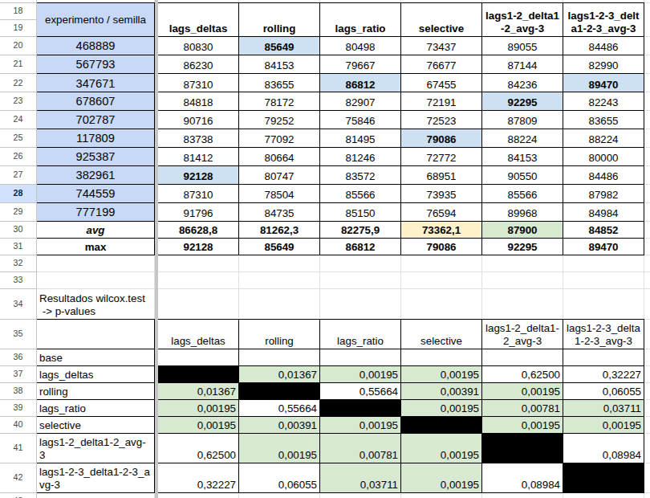
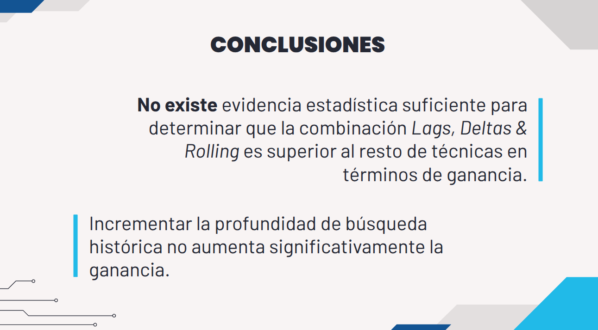
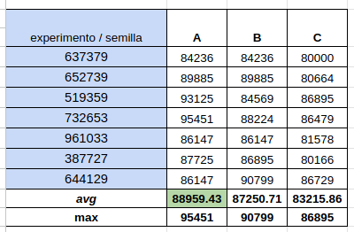

# Aplicaciones de Mineria de Datos a Economia y Finanzas

> Maestría en Mineria de Datos - UTN FRP

## Experimento colaborativo

- Experimento: 9.3.1.5 Feature Engineering historico
- Grupo: A
- Integrantes: Rodriguez Alejandro - Peiretti Tomás
- Notebook: [z6201_WorkFlow_01_junior_grupoA_ale_updated](./src/ExpColaborativos/z6201_WorkFlow_01_junior_grupoA_ale_updated.ipynb)


### Resultados





## Predicción final

- Notebook: [z729_final_junior_updated](./src/PredFinal/z729_final_junior_updated.ipynb)


### Plan

> lags_delta enabled unicamente en la sección de FEhist para todos los experimentos


Teniendo únicamente disponible en fin de semana para ejecutar y analizar experimentos (sábado y domingo, 2 días), a partir de las recomendaciones de todos los grupos se optó por ejecutar los siguientes experimentos:

- Experimento A
```r
PARAM$CA$metodo= "MachineLearning" 

PARAM$DR$metodo <- "estandarizar"

PARAM$INTRA_MENSUAL$metodo = "intra_mensual_true"
PARAM$meses_excluidos <- c()

PARAM$GENETIC$enabled <- "genetic_disabled" 

PARAM$trainingstrategy$training_pct <- 1.0 
PARAM$TRAINING_PCT$metodo <- "training_1_0"
```

- Experimento B:
```r
PARAM$CA$metodo= "MachineLearning" 

PARAM$DR$metodo <- "estandarizar"

PARAM$INTRA_MENSUAL$metodo = "intra_mensual_false"
PARAM$meses_excluidos <- c()

PARAM$GENETIC$enabled <- "genetic_enabled" 

PARAM$trainingstrategy$training_pct <- 1.0 
PARAM$TRAINING_PCT$metodo <- "training_1_0"
```
- Experimento C:
```r
PARAM$CA$metodo= "MachineLearning" 

PARAM$DR$metodo <- "rank_cero_fijo"

PARAM$INTRA_MENSUAL$metodo = "intra_mensual_true"
PARAM$meses_excluidos <- c()

PARAM$GENETIC$enabled <- "genetic_disabled" 

PARAM$trainingstrategy$training_pct <- 1.0 
PARAM$TRAINING_PCT$metodo <- "training_1_0"
```

Por cada experimento se utilizarían 7 semillas lo que en total se traduce a **3x7x7 = 147 envíos a Kaggle** (49 por experimento). Además, se destinarían otros envíos a Kaggle para validar que la incorporación de experimentos de otros grupos funcione correctamente.

### Resultados

Los resultados se encuentran INCOMPLETOS debido a un error durante la ejecución de los experimentos. En lugar de ejecutar el experimento B, se ejecutó por duplicado el experimento A, lo que provocó que se agotara la cantidad de submits disponibles en Kaggle. Por lo tanto, quedaré con la duda de si _Feature Engineering Intra-mes mediante Algoritmo Genético_ podría brindar una ganancia media mayor que los otros experimentos




#### Configuración de parámetros """ganadores"""

```r
PARAM$CA$metodo= "MachineLearning" 

PARAM$DR$metodo <- "estandarizar"

PARAM$INTRA_MENSUAL$metodo = "intra_mensual_true"
PARAM$meses_excluidos <- c()

PARAM$GENETIC$enabled <- "genetic_disabled" 

PARAM$trainingstrategy$training_pct <- 1.0 
PARAM$TRAINING_PCT$metodo <- "training_1_0"
```
