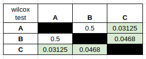

# Aplicaciones de Mineria de Datos a Economia y Finanzas

> Maestría en Mineria de Datos - UTN FRP

## Experimento colaborativo

- Experimento: 9.3.1.5 Feature Engineering historico
- Grupo: A
- Integrantes: Rodriguez Alejandro - Peiretti Tomás
- Notebook: [z6201_WorkFlow_01_junior_grupoA_ale_updated](./src/ExpColaborativos/z6201_WorkFlow_01_junior_grupoA_ale_updated.ipynb)


### Resultados


## Predicción final

- Notebook: [z729_final_junior_updated](./src/PredFinal/z729_final_junior_updated.ipynb)


### Plan

> lags_delta enabled unicamente en la sección de FEhist para todos los experimentos


Teniendo únicamente disponible en fin de semana para ejecutar y analizar experimentos (sábado y domingo, 2 días), a partir de las recomendaciones de todos los grupos se optó por ejecutar los siguientes experimentos:

- Experimento A
```r
PARAM$CA$metodo= "MachineLearning" 

PARAM$DR$metodo <- "estandarizar"

PARAM$INTRA_MENSUAL$metodo = "intra_mensual_true"
PARAM$meses_excluidos <- c()

PARAM$GENETIC$enabled <- "genetic_disabled" 

PARAM$trainingstrategy$training_pct <- 1.0 
PARAM$TRAINING_PCT$metodo <- "training_1_0"
```

- Experimento B:
```r
PARAM$CA$metodo= "MachineLearning" 

PARAM$DR$metodo <- "estandarizar"

PARAM$INTRA_MENSUAL$metodo = "intra_mensual_false"
PARAM$meses_excluidos <- c()

PARAM$GENETIC$enabled <- "genetic_enabled" 

PARAM$trainingstrategy$training_pct <- 1.0 
PARAM$TRAINING_PCT$metodo <- "training_1_0"
```
- Experimento C:
```r
PARAM$CA$metodo= "MachineLearning" 

PARAM$DR$metodo <- "rank_cero_fijo"

PARAM$INTRA_MENSUAL$metodo = "intra_mensual_true"
PARAM$meses_excluidos <- c()

PARAM$GENETIC$enabled <- "genetic_disabled" 

PARAM$trainingstrategy$training_pct <- 1.0 
PARAM$TRAINING_PCT$metodo <- "training_1_0"
```

Por cada experimento se utilzizaron 7 semillas lo que en total se traduce a **3x7x7 = 147 envíos a Kaggle** (49 por experimento). Además, se destinaron otros envíos a Kaggle para validar que la incorporación de experimentos de otros grupos funcione correctamente.

Luego, para uno de los experimentos que obtuvo mejor ganancia media, se realizaron nuevas corridas utilizando distintas semillas. A partir de esto, se recopilaron los archivos correspondientes a las probabilidades predichas, se calculó el promedio de las predicciones para cada cliente y, finalmente, se realizó un último submit en Kaggle utilizando los cortes correspondientes.

> Véase [kaggle_from_probability.ipynb](./src/kaggle_from_probability.ipynb) y [probability_merger.py](./src/probability_merger.py)

### Resultados





#### Configuración de parámetros "ganadores"

```r
PARAM$CA$metodo= "MachineLearning" 

PARAM$DR$metodo <- "estandarizar"

PARAM$INTRA_MENSUAL$metodo = "intra_mensual_true"
PARAM$meses_excluidos <- c()

PARAM$GENETIC$enabled <- "genetic_disabled" 

PARAM$trainingstrategy$training_pct <- 1.0 
PARAM$TRAINING_PCT$metodo <- "training_1_0"
```
> Gana sobre la aplicación del algoritmo genético porque requiere menor tiempo de procesamiento
